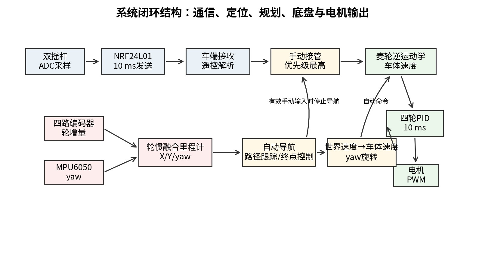
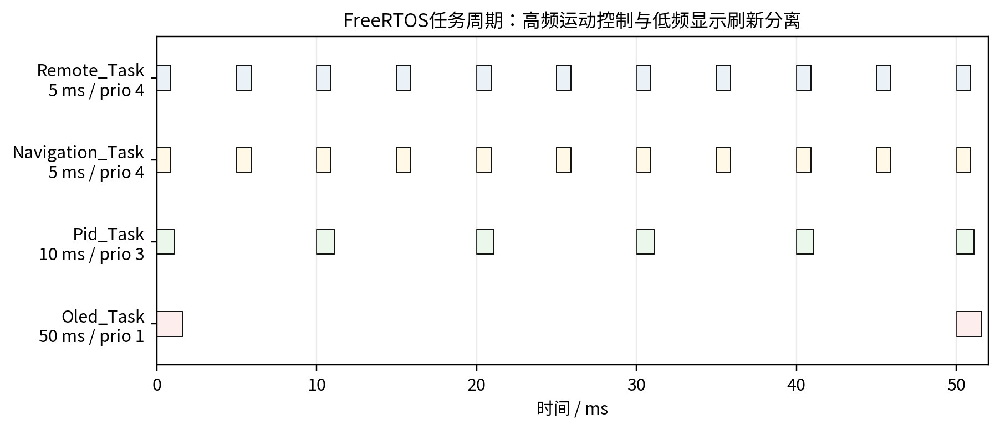
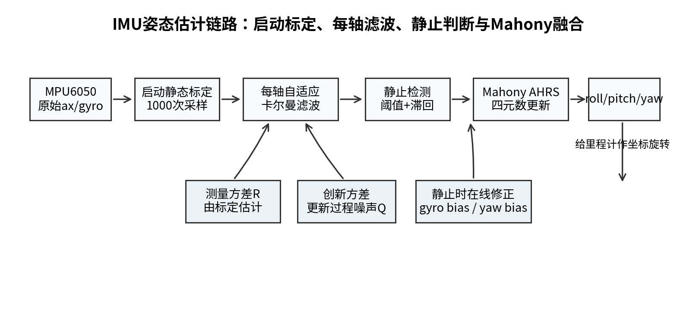
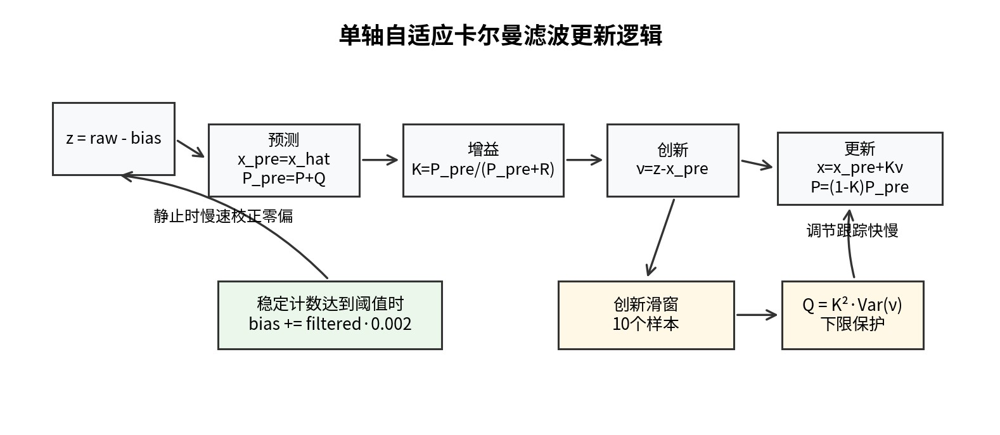
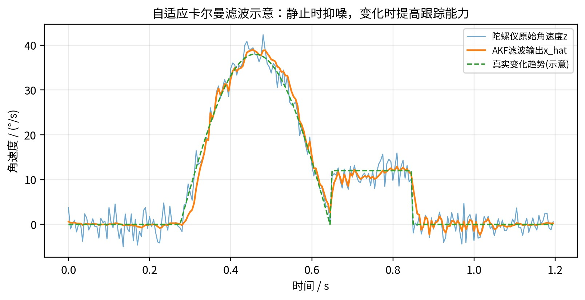
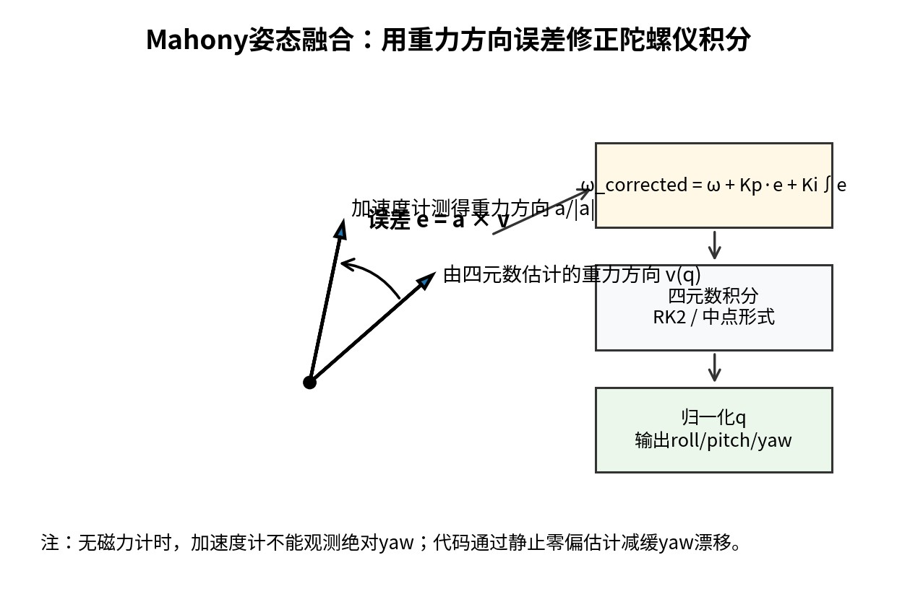
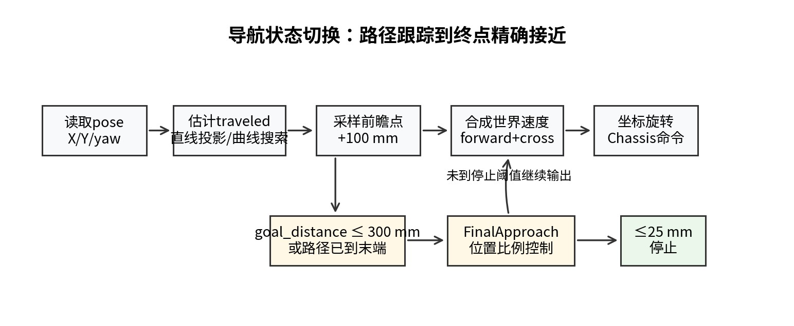
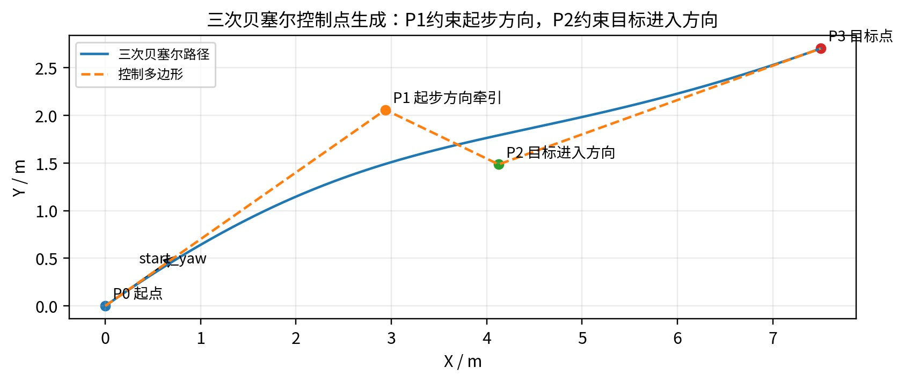
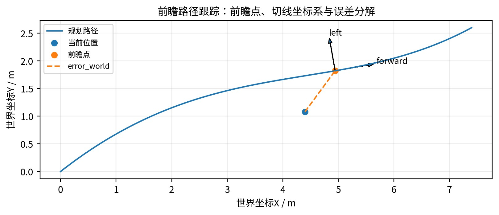

<div align="center">

<h1><b>STM32 轮惯融合全向移动机器人<br/>相对定位与自动导航系统设计与实现</b></h1>

<p><b>基于 main 分支自动导航工程的代码逻辑、运行机制与算法分析</b></p>

<p><b>作者：刘知渊</b> | <b>日期：2026-05-30</b> | <b>项目仓库 main 分支学习报告</b></p>

<p>
  
  
  
  
</p>

</div>

> 本 README 由《学习报告-刘知渊.pdf》转写整理而来。原始 PDF 已保留在仓库中：
>
> [docs/学习报告-刘知渊.pdf](docs/学习报告-刘知渊.pdf)

> 图 1 系统闭环结构：通信、定位、规划、底盘与电机输出
>
> 

> 教学视频
>
> [](https://github.com/lzy9760/STM32-Project/raw/main/docs/videos/navigation_teaching_video_fontsafe_1080p60.mp4)
>
> [点击查看完整教学视频](https://github.com/lzy9760/STM32-Project/raw/main/docs/videos/navigation_teaching_video_fontsafe_1080p60.mp4)

---

## 项目速览

这是一个运行在 STM32F407 车端的四轮麦克纳姆轮自动导航工程。系统用编码器和 MPU6050 构成相对定位链路，在 FreeRTOS 多任务调度下完成遥控接管、路径规划、路径跟踪、底盘解算和四轮 PID 速度闭环。

| 项目项 | 内容 |
| --- | --- |
| 主控平台 | STM32F407 |
| 底盘形式 | 四轮麦克纳姆轮全向移动底盘 |
| 定位方案 | 四路编码器里程计 + MPU6050 yaw 航向角 |
| 控制框架 | FreeRTOS 多任务 + HAL 驱动 |
| 导航算法 | 三次贝塞尔曲线、smoothstep 速度规划、前瞻路径跟踪、终点接近控制 |
| 安全策略 | NRF24L01 遥控优先接管、失联停车、手动输入打断自动导航 |

## 仓库导览

| 路径 | 说明 |
| --- | --- |
| `00_Car_Mecanum_Wheels_AutoNavigation/` | main 分支自动导航车端工程 |
| `00_Remote_NRF_Controller/` | NRF 遥控端工程 |
| `00_Firmware_HEX/` | 固件 HEX 输出 |
| `docs/` | 学习报告 PDF 与 README 配图 |
| `docs/images/` | 系统闭环、任务调度、算法示意图 |

## 核心特性

- 轮惯融合相对定位：编码器提供车体位移，IMU yaw 提供航向参考，并积分得到 X/Y/yaw。
- 全向底盘运动控制：将世界坐标速度转换到车体坐标，再通过麦轮逆运动学输出四轮目标。
- 自动/手动仲裁：自动导航运行时持续检测遥控输入，出现有效手动命令后立即停止导航。
- 路径规划与跟踪：使用贝塞尔曲线生成平滑路径，并结合前瞻点、横向误差反馈和终点接近控制提高稳定性。
- 嵌入式实时实现：遥控、导航、PID 和 OLED 显示任务按不同周期运行，控制链路优先于显示刷新。

## 阅读建议

如果只想快速了解工程，可以先看“项目速览”“工程总体结构与代码分层”和“系统运行逻辑与实时任务调度”。如果需要调车或复现算法，建议重点阅读第 6 到第 13 节，其中包含底盘、IMU、里程计、路径跟踪和参数调试逻辑。


## 摘要

本文围绕一个基于 STM32F407 的四轮麦克纳姆轮移动机器人自动导航工程展开分析。系统采用四路编
码器里程计与 MPU6050 航向角信息构成轮惯融合相对定位链路，在车端实时维护 X/Y/yaw 位姿，并将该位
姿反馈到自动导航控制器中。工程并不是简单的开环定时运动，而是由 FreeRTOS 多任务调度、NRF24L01
遥控接管、四轮 PID 速度闭环、麦轮逆运动学、IMU 自适应滤波、Mahony 姿态估计、三次贝塞尔路径规
划、smoothstep 速度规划、前瞻路径跟踪以及终点精确接近控制共同组成的嵌入式移动机器人闭环系统。
本文重点分析源码层面的运行顺序、模块职责、关键函数调用链、实时任务调度方式，以及定位、路径
规划与路径跟踪算法的数学模型和工程实现逻辑。对自适应卡尔曼滤波的创新方差更新、Mahony AHRS 的
重力方向误差反馈、Pure Pursuit 思想在全向麦轮底盘上的改造、贝塞尔控制点生成、横向误差反馈、世界
坐标到车体坐标的速度变换和终点接近控制进行了系统说明。
**关键词：STM32；麦克纳姆轮；轮惯融合；自适应卡尔曼滤波；Mahony AHRS；贝塞尔曲线；Pure Pursuit；FreeRTOS；PID 速度闭环**

## 目录

- [项目速览](#项目速览)
- [仓库导览](#仓库导览)
- [核心特性](#核心特性)
- [阅读建议](#阅读建议)
- [1. 引言](#1-引言)
- [2. 工程总体结构与代码分层](#2-工程总体结构与代码分层)
- [3. 系统运行逻辑与实时任务调度](#3-系统运行逻辑与实时任务调度)
- [4. 主程序初始化与自动手动控制仲裁](#4-主程序初始化与自动手动控制仲裁)
- [5. 遥控通信与安全接管逻辑](#5-遥控通信与安全接管逻辑)
- [6. 底盘执行层：麦轮逆运动学、编码器与 PID](#6-底盘执行层麦轮逆运动学编码器与-pid)
- [7. 感知定位层：IMU 自适应滤波、Mahony 姿态估计与轮惯融合里程计](#7-感知定位层imu-自适应滤波mahony-姿态估计与轮惯融合里程计)
- [8. 自动导航状态机与核心数据结构](#8-自动导航状态机与核心数据结构)
- [9. 路径规划算法：三次贝塞尔曲线](#9-路径规划算法三次贝塞尔曲线)
- [10. 速度规划：smoothstep 平滑加减速](#10-速度规划smoothstep-平滑加减速)
- [11. 路径跟踪算法：全向底盘版本 Pure Pursuit](#11-路径跟踪算法全向底盘版本-pure-pursuit)
- [12. 终点精确接近控制](#12-终点精确接近控制)
- [13. 参数标定、调试现象与优化方向](#13-参数标定调试现象与优化方向)
- [14. 结论与资料来源](#14-结论与资料来源)


## 1. 引言

移动机器人导航系统通常由定位、规划、控制和执行四个层次构成。对小型室内麦轮机器人而言，复杂
的全局地图规划并不是最迫切的问题，首先需要解决的是：车辆能否稳定读取自身位姿，能否根据目标点生
成平滑轨迹，能否把路径误差转化为底盘速度，并且能否在人工接管时立即停止自动控制。该工程围绕这些
问题建立了完整链路。
从工程定位看，系统的核心价值在于把“传感器采集 - 位姿估计 - 路径规划 - 路径跟踪 - 底盘闭环 - 电机
输出”放在 STM32 车端实时运行。由于主控端没有 UWB、视觉或激光雷达等绝对定位传感器，项目采用相
对定位方案：编码器提供车体位移，IMU yaw 提供航向参考，最终通过坐标旋转和积分得到相对世界坐标。
该方法适合短中距离室内导航，其优点是硬件成本低、控制链路直接、实时性好；局限是误差会随着距离和
打滑累积。
从算法选型看，工程没有为了形式复杂而堆叠模型，而是按嵌入式资源和实际车体特性取舍：IMU 原始
陀螺仪数据先经过每轴自适应卡尔曼滤波抑制随机噪声，再由 Mahony AHRS 进行姿态融合；路径部分使用
三次贝塞尔曲线保证几何连续，用 smoothstep 降低起步和停车冲击，用前瞻跟踪保证路径收敛稳定性，用
终点接近控制提升最终停靠精度。

## 2. 工程总体结构与代码分层

自动导航工程位于仓库 main 分支的 00_Car_Mecanum_Wheels_AutoNavigation 目录下。工程采用
STM32Cube/HAL 与 FreeRTOS 组合，用户应用代码主要集中在 MDK-ARM/UserApp/Core/Src 与 Inc 目
录。为了便于理解，可将其划分为五层。

| 层级 | 主要文件 | 职责 | 输入/输出关系 |
| --- | --- | --- | --- |
| 应用入口层 | `app.c`, `app_freertos.c` | 系统初始化、任务创建、自动导航入口、手动接管仲裁 | 调用各模块 `Init`/`Task`，决定导航或遥控哪个控制底盘 |
| 通信交互层 | `app_nrf24l01.c`, `app_nrf_remote.c`, `app_remote.c`, `app_oled.c` | NRF 遥控接收、摇杆解析、失联保护、OLED 状态显示 | 遥控包 -> 运动命令；位姿/NRF 状态 -> OLED |
| 感知定位层 | `app_encoder.c`, `app_mpu6050.c`, `app_imu_filter.c`, `app_imu_ahrs.c`, `app_odometry.c` | 编码器读取、IMU 滤波与姿态估计、轮惯融合里程计 | 轮增量/yaw -> X/Y/yaw |
| 规划跟踪层 | `app_path_planner.c`, `app_navigation.c` | 生成路径、采样目标、估计进度、路径跟踪、终点控制 | 目标点 + 当前位姿 -> 车体速度命令 |
| 执行控制层 | `app_chassis.c`, `app_motor.c`, `pid.c`, `pid.h` | 麦轮逆运动学、PWM 方向控制、四轮 PID 速度闭环 | vx/vy/w -> 四轮目标 -> PWM 输出 |

这种分层有两个好处。第一，运动控制与显示、通信分离，OLED 刷新不会影响高频控制任务。第二，
导航层只需要面对抽象后的 pose 和 Chassis_SetNormalizedMotion 接口，不需要直接关心每个电机的
PWM 极性、编码器定时器或 NRF 寄存器配置。


## 3. 系统运行逻辑与实时任务调度

工程上电后的运行链路可以概括为：HAL 初始化外设，进入 App_Init 完成用户模块初始化，随后启动
FreeRTOS 调度器，由多个周期任务持续运行。与传统 while(1) 轮询相比，FreeRTOS 任务划分让遥控、导
航、PID 和显示各自保持固定节拍。
> 图 2 FreeRTOS 任务周期示意：高频运动控制与低频显示刷新分离
>
> 

app_freertos.c 中任务周期与优先级体现了系统实时性取舍：遥控任务和导航任务均为 5 ms，优先级为
4；PID 任务为 10 ms，优先级为 3；OLED 任务为 50 ms，优先级为 1。也就是说，运动命令更新和人工接
管优先于显示刷新。

| 任务 | 周期 | 优先级 | 关键调用 | 设计意义 |
| --- | --- | --- | --- | --- |
| `Remote_Task` | 5 ms | 4 | `Remote_ControlTask`, `Remote_HasManualCommand` | 自动导航关闭时接管底盘；自动导航运行时持续监测是否有人为输入 |
| `Navigation_TaskEntry` | 5 ms | 4 | `Navigation_Task` | 自动导航闭环，读取位姿并输出底盘运动命令 |
| `Pid_Task` | 10 ms | 3 | `Pid_UpdateAll` | 独立维持四轮速度闭环，减小电机差异影响 |
| `Oled_Task` | 50 ms | 1 | `AppOled_Task` | 显示状态和坐标，优先级最低，避免阻塞控制链路 |

## 4. 主程序初始化与自动/手动控制仲裁

app.c 是用户应用入口。App_Init 的顺序不是随意排列的，它体现了“先执行层安全，再感知层初始
化，最后导航启动”的原则。

```c
App_Init():
    Motor_StartAllPwm()
    Motor_StopAll()
    Encoder_Init()
    Pid_InitAll()

    Remote_Init()
    MPU6050_Init()
    Navigation_Init()
    AppOled_Init()

    if APP_AUTO_NAV_ENABLE:
        Navigation_StartTo(target_x, target_y, speed)
```

这里先启动 PWM 再 Motor_StopAll，是为了保证电机控制通道进入已知安全状态；随后初始化编码器
和 PID，使底盘闭环具备反馈能力；再初始化遥控、IMU、导航和显示。若 APP_AUTO_NAV_ENABLE 为
1，系统会在上电后直接把当前位姿作为起点，并以宏定义的目标坐标启动导航。
自动/手动仲裁逻辑是工程安全性的关键。自动导航不是“锁死”的，只要遥控器出现有效手动输入，
Remote_Task 会停止导航并调用遥控控制。换句话说，手动输入优先级高于自动导航。这种设计适合实验
车调试：算法跑偏时操作者可以立即接管。

```c
if Navigation_IsActive():
    if Remote_HasManualCommand():
        Navigation_Stop()
        Remote_ControlTask()
    else:
        Navigation_Task()
else:
    Remote_ControlTask()

Pid_UpdateAll()
AppOled_Task()
```

## 5. 遥控通信与安全接管逻辑

遥控链路采用 NRF24L01 单向发送方式。遥控端 STM32F103C8 周期读取四路 ADC 摇杆值，并打包成固
定 4 字节数据；车端 STM32F407 只负责接收和解析遥控包。当前设计放弃遥控端坐标回传，把坐标显示转
移到车端 OLED，目的是避免 ACK Payload 或双向收发切换占用无线时序，保证控制包连续到达。

| 处理环节 | 代码含义 | 解决的问题 |
| --- | --- | --- |
| 0~255 映射 | 把摇杆字节映射到 -100~100 | 将 ADC 输入转换为归一化控制量 |
| 平移死区 | 小幅偏移直接视为 0 | 抑制摇杆中位漂移 |
| yaw 单轴死区 | 右摇杆单轴先死区，再组合成旋转命令 | 避免轻微误触产生旋转 |
| 连续新包确认 | 平移/旋转需要连续若干有效包 | 过滤偶发异常包 |
| 失联保护 | 500 ms 无新包则停车 | 无线中断时保证安全 |
| 停车确认 | 空闲状态保持一段时间再认为停止 | 减少轮子抽动 |

Remote_HasManualCommand 并不是简单判断摇杆是否非零，而是结合死区、确认计数和最近接收状
态来判定“是否真的有人在控制”。因此它可以作为自动导航接管条件。该逻辑对实验车很有价值：既不能
过于敏感导致导航经常被误打断，也不能过于迟钝导致危险时无法接管。


## 6. 底盘执行层：麦轮逆运动学、编码器与 PID


### 6.1 麦克纳姆轮逆运动学

底盘接口 Chassis_SetNormalizedMotion 接收三个归一化命令：vx 表示车体前进/后退，vy 表示车体
左右平移，w 表示原地旋转。由于麦克纳姆轮允许全向移动，系统不需要像普通差速车那样先转向再前进，
而是可以同时分解出前进、横移和旋转。

```c
front_left  = vx - vy + w
front_right = vx + vy - w
rear_left   = vx + vy + w
rear_right  = vx - vy - w

max_mag = max(1, abs(front_left), abs(front_right), abs(rear_left), abs(rear_right))
wheel_i = wheel_i / max_mag
wheel_i = wheel_i * per_wheel_gain
```

归一化的意义是，当多个自由度叠加导致某个轮子的理论输出超过范围时，整体等比例缩放，避免个别
轮子饱和而破坏运动方向。每轮独立增益在逆运动学之后施加，用于补偿电机、减速箱、轮径和地面摩擦差
异。

### 6.2 电机 PWM 与四轮 PID 速度闭环

电机控制层负责将轮子目标速度转成方向与 PWM。PID 任务每 10 ms 读取一次编码器增量作为速度反
馈，并采用“基础目标 PWM + PID 修正”的结构。基础 PWM 提供克服静摩擦的前馈量，PID 项补偿实际速
度与目标速度之间的差值。

```c
now_speed = now_count - last_count
error = target_speed - now_speed
output = target_pwm + kp * error + ki * sum_error + kd * (error - last_error)
output = clamp(output, pwm_min, pwm_max)
```

这里的积分限幅很重要。如果电机被卡住或起步阶段误差较大，积分项可能迅速累积，解除卡滞后会造
成过冲。通过限制 sum_error，系统把 PID 闭环控制在更可预测的范围内。

## 7. 感知定位层：IMU 自适应滤波、Mahony 姿态估计与轮惯融合里程计


### 7.1 IMU 数据链路总览

IMU 部分负责提供 yaw 航向角。上电时要求车辆保持静止，程序采集陀螺仪和加速度计零偏；运行中先
对每个陀螺仪轴进行自适应卡尔曼滤波，再结合静止检测进行零偏微调，最后由 Mahony AHRS 输出 roll、
pitch、yaw。导航中真正核心的是 yaw，因为轮式里程计需要用 yaw 把车体位移旋转到世界坐标。

> 图 3 IMU姿态估计链路：标定、滤波、静止判断、Mahony融合和里程计使用关系
>
> 

该链路中，app_mpu6050.c 负责 MPU6050 寄存器配置、启动标定、传感器读取和航向保持接口；
app_imu_filter.c 负责每轴自适应卡尔曼滤波和静止零偏修正；app_imu_ahrs.c 负责四元数形式的
Mahony 姿态融合。这种拆分使“传感器读取、滤波估计、姿态融合、导航使用”边界清楚，后续若更换
IMU 或增加磁力计，也更容易替换局部模块。

### 7.2 自适应卡尔曼滤波的代码逻辑

app_imu_filter.c 中的 ImuFilter_Akf_t 是一维卡尔曼滤波器状态结构，包含 x_hat、x_pre、p、
p_pre、k、q、r、innovation、innovation_var 以及长度为 10 的创新滑窗。工程中每个陀螺仪轴独立维护
一个 ImuFilter_GyroAxis_t，因此 x/y/z 三个角速度轴互不耦合，计算量小，适合 STM32F407 周期执行。

| 字段 | 含义 | 在滤波中的作用 |
| --- | --- | --- |
| `x_hat` | 上一时刻最优估计 | 作为下一次预测的状态输入 |
| `p` | 估计误差协方差 | 反映当前估计可信度 |
| `q` | 过程噪声方差 | 越大表示状态变化可能越快，滤波器跟踪更敏感 |
| `r` | 测量噪声方差 | 由启动标定阶段的陀螺仪方差估计 |
| `k` | 卡尔曼增益 | 决定本次更新更相信预测还是测量 |
| `innovation` | 创新/残差 `z - x_pre` | 判断当前测量与预测差异 |
| `innovation_var` | 创新滑窗均方值 | 用于自适应调整 `q` |

这里使用的是常值模型：假设一个采样周期内真实角速度变化不剧烈，预测值直接等于上一时刻估计
值。滤波器每次先预测，再计算增益和创新，最后用创新修正状态。

```c
x_pre = x_hat
p_pre = p + q
k = p_pre / (p_pre + r)
innovation = z - x_pre
x_hat = x_pre + k * innovation
p = (1 - k) * p_pre
```

传统卡尔曼滤波要求过程噪声 Q 与测量噪声 R 事先给定。该工程的处理比较有工程味：R 在
MPU6050_Init 的启动静态标定阶段由陀螺仪原始采样方差换算得到；Q 则不是固定值，而是通过创新滑窗
方差自适应更新。代码中的核心形式可以写成：

```c
innovation_window[window_idx] = innovation
innovation_var = mean(innovation_window[i] * innovation_window[i])
q = k * k * innovation_var

if q < IMU_FILTER_MIN_Q:
    q = IMU_FILTER_MIN_Q
```

> 图 4 单轴自适应卡尔曼滤波更新逻辑：由创新方差调节过程噪声Q
>
> 

这段逻辑的直观含义是：当车辆静止或角速度变化很平稳时，创新较小，Q 保持较低，滤波器更偏向平
滑抑噪；当车辆转动或外界扰动导致测量与预测差异变大时，创新方差上升，Q 随之增大，滤波器会更快跟
随真实变化。这样比固定 Q 的滤波器更适合“静止标定 - 低速移动 - 偶发转向”的实验车场景。
> 图 5 自适应卡尔曼滤波效果示意：静止段抑制噪声，变化段保持跟踪能力
>
> 


此外，ImuFilter_GyroUpdate 在 allow_static_bias 允许的条件下还进行静止零偏更新。代码通过两个
条件确认稳定：一是连续两次滤波输出变化量小于 0.01 dps，二是滤波输出绝对值小于 2.0 dps；稳定计数
达到 100 后，认为该轴处于可校正状态，并按 0.002 的系数缓慢更新 bias_dps。该设计不是一次性强行归
零，而是慢速修正，避免短时噪声或轻微振动把零偏估计拉偏。

```c
corrected_dps = raw_dps - bias_dps
filtered_dps = AkfUpdate(corrected_dps)

if allow_static_bias:
    if abs(filtered_dps - last_filtered_dps) < 0.01 and abs(filtered_dps) < 2.0:
        stable_count += 1
    else:
        stable_count = 0

    if calibrated or stable_count >= 100:
        bias_dps += filtered_dps * 0.002
        filtered_dps = 0
```

需要注意的是，这里的自适应卡尔曼滤波不是用于直接估计小车的 X/Y 位置，而是用于处理陀螺仪角速
度。其输出再送入 Mahony AHRS，最终影响 yaw。这样做的优点是把噪声处理前移到姿态估计之前，降低
yaw 积分过程中的高频抖动。

### 7.3 Mahony AHRS 姿态融合算法

Mahony AHRS 属于非线性互补滤波思想：陀螺仪角速度负责短时间动态响应，加速度计测得的重力方
向负责长期姿态修正。与直接对欧拉角积分不同，代码使用四元数 q0、q1、q2、q3 表示姿态，可避免欧拉
角在大角度时的奇异问题。Mahony 等人的经典工作是在 SO(3) 旋转群上构造非线性互补滤波器，对低成本
IMU 姿态估计很有参考价值。
app_imu_ahrs.c 中先归一化加速度计测量值，再由当前四元数计算估计重力方向，二者叉乘得到姿态
误差 halfex、halfey、halfez。这个误差可以理解为“估计姿态下的重力方向”和“实际测得的重力方
向”之间的偏差。随后用比例项和积分项修正陀螺仪角速度，再对四元数积分。

```c
norm = sqrt(ax*ax + ay*ay + az*az)
ax /= norm
ay /= norm
az /= norm

# 由当前四元数估计重力方向
halfvx = q1*q3 - q0*q2
halfvy = q0*q1 + q2*q3
halfvz = q0*q0 - 0.5 + q3*q3

# 重力方向误差，等价于 measured x estimated
halfex = ay*halfvz - az*halfvy
halfey = az*halfvx - ax*halfvz
halfez = ax*halfvy - ay*halfvx
```

> 图 6 Mahony姿态融合几何关系：利用重力方向误差修正陀螺仪积分
>
> 

工程代码还根据车辆是否静止切换 Mahony 增益。静止时 Kp=4.0、Ki=0.002，能够更快把 roll/pitch 拉
回重力方向，并允许积分项慢速消除小偏差；动态时 Kp 降为 0.01、Ki 置 0，避免车辆加减速或麦轮横移产
生的线加速度被误认为重力方向，从而污染姿态估计。积分项被限制在 ±0.05，避免长时间异常测量导致积
分饱和。

| 参数 | 代码值 | 作用 | 工程意义 |
| --- | --- | --- | --- |
| `IMU_AHRS_KP_STATIC` | 4.0 | 静止时比例修正 | 静止时快速校正姿态误差 |
| `IMU_AHRS_KP_DYNAMIC` | 0.01 | 动态时比例修正 | 移动时弱化加速度计影响 |
| `IMU_AHRS_KI_STATIC` | 0.002 | 静止时积分修正 | 慢速消除小偏差 |
| `IMU_AHRS_KI_DYNAMIC` | 0.0 | 动态时关闭积分 | 避免运动加速度造成积分漂移 |
| `IMU_AHRS_INTEGRAL_MAX/MIN` | ±0.05 | 积分限幅 | 防止异常状态下过修正 |
| `IMU_AHRS_YAW_BIAS_MAX` | ±0.1 rad/s | yaw 零偏限幅 | 约束静止 yaw 偏置估计范围 |

代码中的 yaw_bias_rad_s 也值得单独说明。由于 MPU6050 没有磁力计，加速度计只能提供重力方
向，无法观测绝对 yaw，因此 yaw 的长期稳定主要依赖陀螺仪零偏是否足够准。工程中在静止状态下根据
gz_corrected 缓慢更新 yaw_bias_rad_s，并设置 ±0.1 rad/s 限幅。它不能从原理上消除所有 yaw 漂移，
但能明显减小静止和低速场景下的慢漂。

```c
if is_static:
    gz_corrected = gz - yaw_bias_rad_s
    yaw_kp = (abs(gz_corrected) > 0.005) ? 0.02 : 0.015
    yaw_bias_rad_s += yaw_kp * gz_corrected * dt
    yaw_bias_rad_s = clamp(yaw_bias_rad_s, -0.1, 0.1)
    gz -= yaw_bias_rad_s
```

四元数积分部分没有使用最简单的一阶欧拉法，而是先计算 k1，再得到中间四元数 q_mid，归一化后计
算 k2，最后用 k2 更新 q。这相当于一个二阶中点/RK2 思路，在同样采样周期下比直接欧拉积分更稳一些。
每次更新后都会重新归一化四元数，避免数值误差使 q 的模长逐渐偏离 1。
最后，ImuAhrs_MahonyGetEulerDeg 将四元数转换为 roll、pitch、yaw。导航层主要使用 yaw，但
roll/pitch 的存在有助于诊断 IMU 安装是否水平、车辆加减速是否造成姿态扰动，以及后续是否需要引入更
完整的姿态补偿。

### 7.4 四轮编码器里程计与 yaw 坐标旋转

编码器给出的不是世界坐标，而是每个轮子的增量计数。首先需要把计数换算为轮子线位移，然后根据
麦轮结构反解出车体坐标系下的前进量和侧移量。

```c
distance_i = count_delta_i / counts_per_rev * pi * wheel_diameter
body_forward = (d_fl + d_fr + d_rl + d_rr) / 4 * ODOM_FORWARD_SCALE
body_strafe = (-d_fl + d_fr + d_rl - d_rr) / 4 * ODOM_STRAFE_SCALE
```

得到车体位移后，还必须根据当前 yaw 旋转到世界坐标。代码使用中点航向 yaw_mid，而不是简单使
用更新后的 yaw。这样在车辆边移动边旋转时，可以把整段小位移近似看作发生在中间姿态下，积分误差会
更小。

```c
x_world += forward * cos(yaw_mid) - strafe * sin(yaw_mid)
y_world += forward * sin(yaw_mid) + strafe * cos(yaw_mid)
```

该定位方法属于相对定位：每次上电时当前位置作为坐标原点。其优势是实现简单、实时性高；缺点是
编码器比例误差、轮子打滑、地面摩擦变化和 yaw 漂移都会随距离累积。因此短距离自动导航误差应理解为
标定良好、不明显打滑条件下的结果。

## 8. 自动导航状态机与核心数据结构

自动导航主要由 app_navigation.c 实现。内部维护一个 Navigation_State_t 状态结构，包含 active 标
志、是否跟随路径 yaw、贝塞尔路径、起点、目标点、路径长度、直线长度、已行驶距离、起始 yaw 和直线
路径的 forward/left 单位向量。

| 状态字段 | 含义 | 运行中的作用 |
| --- | --- | --- |
| `active` | 导航是否正在运行 | 为 0 时 `Navigation_Task` 直接返回，为 1 时进入闭环控制 |
| `follow_path_yaw` | 是否按曲线路径方向跟随 | 目标方向与当前 yaw 差大于阈值时使用曲线跟踪 |
| `path` | 三次贝塞尔路径控制点和速度参数 | 提供路径采样点、切线和速度规划 |
| `start` / `goal` | 起点和目标点 | 用于直线投影、终点误差和控制点生成 |
| `path_length_mm` / `line_length_mm` | 曲线长度估计与起终点直线距离 | 用于 `traveled` 到 `progress` 的映射 |
| `traveled_mm` | 当前路径进度估计 | 决定前瞻点位置和速度规划位置 |
| `start_yaw_deg` | 启动导航时的车体航向 | 直线模式和终点接近时用于保持或回到起始朝向 |

Navigation_StartTo 是状态机入口。它先读取当前里程计位姿作为 start，接收目标坐标作为 goal，然
后调用 PathPlanner_BuildCubicTo 构建曲线路径；接着计算直线路径方向，用目标方向与当前 yaw 的角度
差决定是否启用 follow_path_yaw。

> 图 7 自动导航状态机：路径跟踪与终点接近控制的切换关系
>
> 


## 9. 路径规划算法：三次贝塞尔曲线


### 9.1 曲线模型

三次贝塞尔曲线由四个控制点 P0、P1、P2、P3 决定，参数 t 从 0 到 1。P0 是起点，P3 是终点，P1 和
P2 不一定经过，而是用于控制起点附近和终点附近的切线方向。

```text
B(t) = (1 - t)^3 P0
     + 3(1 - t)^2 t P1
     + 3(1 - t) t^2 P2
     + t^3 P3, 0 <= t <= 1

B'(0) = 3(P1 - P0)
B'(1) = 3(P3 - P2)
```

从导数可以看出，起点处的切线方向由 P0 指向 P1 决定，终点处的切线方向由 P2 指向 P3 决定。因此控
制点的本质是“控制曲线从哪里出去、从哪里进入目标”。这也是贝塞尔曲线适合嵌入式导航的原因：只需
少量点和固定公式，就能得到平滑轨迹。

### 9.2 控制点生成逻辑

PathPlanner_BuildCubicTo 的控制点生成逻辑如下：先计算起点到目标点的直线距离 distance，然后
令 control = distance * 0.45。如果 control 小于 80 mm，则强制使用 80 mm 作为最小控制距离。

```c
distance = Distance(start, goal)
control = distance * PATH_MAX_CONTROL_RATIO  // 0.45

if control < PATH_MIN_CONTROL_MM:
    control = PATH_MIN_CONTROL_MM  // 80 mm

P0 = start
P3 = goal
P1 = start + [cos(start_yaw), sin(start_yaw)] * control
P2 = goal - normalize(goal - start) * control
```

> 图 8 三次贝塞尔控制点生成示意：P1约束起步方向，P2约束目标进入方向
>
> 

P1 沿当前车头方向前推，使曲线刚开始时尽量顺着车辆当前朝向驶出，避免起步瞬间要求底盘产生很大
的横向速度。P2 从目标点沿起终点方向反推，使曲线进入目标点时尽量沿整体路径方向收敛，而不是在终点
附近突然横向冲入。
当前实现没有单独传入 goal_yaw，因此 P2 使用的是“起点指向目标点”的方向。这意味着系统能保证
平滑到达某个坐标点，但不能严格保证到达点时车头朝某个指定角度。若后续要实现“位姿到位姿”导航，
可以将 P2 改为 goal - [cos(goal_yaw), sin(goal_yaw)] * control，并在终点控制中加入独立姿态收敛条件。

### 9.3 曲线采样、切线和长度估算

路径跟踪需要的不只是路径点，还需要路径切线。Path_TangentAt 直接使用三次贝塞尔的一阶导数计
算切线向量，导航层再通过 atan2 得到期望航向。曲线长度没有简单闭式解，工程中采用 24 段采样累加近
似弧长。对 3 m 级导航来说，该计算量很小，且精度足够。
需要注意的是，当前 traveled_mm / length 直接映射到参数 t，这属于近似弧长参数化；如果曲率较
大，速度沿曲线的分布不完全均匀。更严格的方法是离线或实时建立弧长查找表 LUT，用二分搜索从
traveled 得到 t。

## 10. 速度规划：smoothstep 平滑加减速

路径规划模块同时输出当前规划速度。速度规划的目的不是求全局最优，而是避免起步打滑和终点过
冲。代码采用 smoothstep 函数：先根据已行驶距离和剩余距离计算加速/减速进度，再取二者较小值作为速
度缩放因子。

```c
accel_progress = clamp(traveled / accel_distance, 0, 1)
decel_progress = clamp((length - traveled) / accel_distance, 0, 1)
s = min(accel_progress, decel_progress)
speed_scale = 3*s^2 - 2*s^3
speed = min_speed + (max_speed - min_speed) * speed_scale
```

smoothstep 的特点是 s=0 和 s=1 两端的一阶导数为 0，因此速度不会从 0 瞬间跳到某个较大值，也不
会在接近终点时突然断崖式减速。对麦克纳姆轮来说，这一点尤其重要：横向滚子与地面摩擦较敏感，速度
突变更容易引起滑移。

| 参数 | 当前值 | 意义 | 调参影响 |
| --- | --- | --- | --- |
| `PATH_DEFAULT_MIN_SPEED` | 70 mm/s | 最低路径速度 | 太低可能克服不了静摩擦；太高会增加终点过冲 |
| `PATH_ACCEL_RATIO` | 0.25 | 加减速距离占路径比例 | 越大越平滑，但高速段变短 |
| `PATH_MIN_CONTROL_MM` | 80 mm | 最小控制点/最小加速距离 | 防止短距离路径过硬 |
| `NAV_MAX_TARGET_SPEED` | 420 mm/s | 速度归一化参考 | 影响规划速度到底盘归一化命令的映射 |

## 11. 路径跟踪算法：全向底盘版本 Pure Pursuit


### 11.1 与标准 Pure Pursuit 的区别

传统 Pure Pursuit 常用于阿克曼车辆：车辆根据前瞻点计算曲率，再转成前轮转角。该项目的底盘是麦
克纳姆轮全向底盘，能够直接产生二维平移速度，因此没有必要先计算转弯半径。工程实现更准确地说
是“Pure Pursuit 思想的全向底盘改造版”：用前瞻点提高稳定性，用路径切线建立局部坐标系，再用横向
误差反馈修正偏离。

### 11.2 路径进度估计

Navigation_Task 每 5 ms 执行一次。首先更新 IMU 和里程计，然后计算当前位置到目标点的误差。接
着估计车辆在路径上的进度 traveled_mm。

```c
if follow_path_yaw:
    traveled = FindNearestProgressOnBezier(pose)  // 24 步搜索最近路径点，并禁止进度倒退
else:
    traveled = ProjectPoseToStraightLine(pose)    // 把当前位置投影到起点-目标方向
```

直线模式适用于目标方向与当前车头方向差别较小的情况，此时不需要车辆按曲线转向，只需保持起始
yaw 并沿直线位移。曲线模式用于目标方向与当前 yaw 差值超过阈值的情况，此时车辆通过贝塞尔路径平滑
调整运动方向。

### 11.3 前瞻点选择与误差分解

当前前瞻距离为 100 mm。系统不直接追踪最近路径点，而是追踪路径前方一定距离的点，这样可以降
低局部误差导致的抖动。

```c
lookahead_travel = traveled_mm + NAV_LOOKAHEAD_MM
lookahead_travel = min(lookahead_travel, path_length_mm)
target = SamplePath(lookahead_travel).target
```

得到前瞻点后，代码使用该点处的路径切线方向建立 forward/left 坐标系。误差 error_world = target -
pose 被分解为沿路径方向误差 along_error 和横向误差 cross_error。

```c
path_forward = [cos(desired_heading), sin(desired_heading)]
path_left = [-path_forward_y, path_forward_x]
along_error = dot(error_world, path_forward)
cross_error = dot(error_world, path_left)
```

> 图 9 前瞻路径跟踪几何关系：前瞻点、切线坐标系与误差分解
>
> 


### 11.4 横向误差反馈与速度命令合成

速度命令由三部分构成：基础前进速度、沿路径误差修正、横向误差修正。横向修正 cross_cmd 同时考
虑当前前瞻点横向误差和终点方向横向误差，使车辆既能贴近局部路径，又不会被局部路径引导得偏离最终
目标。

```c
cross_cmd = cross_error * NAV_CROSS_TRACK_KP + goal_cross_error * NAV_GOAL_TRACK_KP
cross_cmd = clamp(cross_cmd, -0.35, 0.35)

dx_world = path_forward_x * speed_scale
         + path_forward_x * clamp(along_error * NAV_GOAL_TRACK_KP, -0.10, 0.10)
         + path_left_x * cross_cmd

dy_world = path_forward_y * speed_scale
         + path_forward_y * clamp(along_error * NAV_GOAL_TRACK_KP, -0.10, 0.10)
         + path_left_y * cross_cmd
```

这段控制律的逻辑非常清晰：forward 方向负责沿路径推进，left 方向负责把车辆拉回路径，
goal_cross_error 负责避免只盯着局部前瞻点而忽略最终目标。cross_cmd 限幅是必要的，因为过大的横向
速度会让麦轮打滑或震荡。

### 11.5 世界坐标速度到车体坐标速度

导航算法在世界坐标系中计算目标速度，而底盘运动学需要车体坐标系命令。因此必须根据当前 yaw 做
旋转变换。

```c
dx_body = dx_world * cos(yaw) + dy_world * sin(yaw)
dy_body = -dx_world * sin(yaw) + dy_world * cos(yaw)
```

这个公式的直观含义是：导航层说“在世界坐标里应该往哪里走”，底盘层需要知道“以当前车头为前
方，四个轮子应该怎样合成这个速度”。没有这个坐标变换，车辆只要车头方向不等于世界 x 轴，运动方向
就会错。


### 11.6 yaw 控制

yaw 控制采用比例控制，并加入角度归一化、死区和限幅。曲线模式下目标 yaw 通常取路径切线方向；
直线模式下目标 yaw 取起始 yaw，目的是保持车身姿态稳定。

```c
heading_error = wrap_deg(target_yaw - current_yaw)

if abs(heading_error) <= 2 deg:
    yaw_cmd = 0
else:
    yaw_cmd = clamp(heading_error * NAV_YAW_KP, -NAV_YAW_LIMIT, NAV_YAW_LIMIT)
```

## 12. 终点精确接近控制

路径跟踪适合沿路径前进，但接近目标点时继续追踪切线并不一定最优。因为前瞻点已经接近路径末
端，切线方向可能不再稳定，且车辆可能沿路径方向滑过目标点。因此代码设置终点接近阈值 300 mm：当
车辆进入该范围，或者路径进度已经达到末端时，切换到 FinalApproach。

```c
if goal_distance <= NAV_POSITION_TOL_MM:
    Navigation_Stop()

if goal_distance <= NAV_FINAL_APPROACH_MM or traveled_mm >= line_length_mm:
    RunFinalApproach()
```

终点接近模式不再主要依赖路径切线，而是直接对目标点误差做比例控制。离目标越远，速度越大；越
靠近目标，速度越小，并通过限幅避免过大的末端速度。

```c
dx_world = clamp((goal_x - current_x) * NAV_FINAL_POS_KP, -0.35, 0.35)
dy_world = clamp((goal_y - current_y) * NAV_FINAL_POS_KP, -0.35, 0.35)
// 再根据当前 yaw 旋转到车体坐标并输出给底盘
```

终点附近 yaw 修正也会逐步减小。当距离目标小于 80 mm 时，yaw_cmd 直接置零，避免车辆已经接
近目标点却为了调整角度产生额外平移。最终停止阈值为 25 mm，这与短距离导航误差的量级相匹配。

## 13. 参数标定、调试现象与优化方向


### 13.1 参数调试逻辑

| 现象 | 优先检查参数/模块 | 原因分析 | 建议 |
| --- | --- | --- | --- |
| 直线总偏一侧 | `CHASSIS_*_GAIN`, `ODOM_FORWARD_SCALE`, yaw 零偏 | 轮径、摩擦、电机差异或航向偏差 | 先测纯前进，再逐轮微调增益 |
| 侧移距离不准 | `ODOM_STRAFE_SCALE` | 麦轮侧向滑移比前进更明显 | 左右侧移分别测多次取平均 |
| 静止 yaw 缓慢漂移 | gyro bias、`yaw_bias_rad_s`、静止检测阈值 | 陀螺仪零偏未完全收敛或静止判断过松 | 上电保持静止；调小静止误判概率；检查机械振动 |
| IMU 输出抖动 | AKF 测量方差 R、创新滑窗、`MPU6050_DLPF` | 原始陀螺仪噪声或线缆/供电干扰 | 先观察原始角速度，再确认滤波后曲线是否平滑 |
| 曲线跟踪抖动 | `NAV_LOOKAHEAD_MM`, `NAV_CROSS_TRACK_KP` | 前瞻太短或横向反馈太强 | 适当增大前瞻，减小横向 Kp |
| 曲线切弯明显 | `NAV_LOOKAHEAD_MM`, `NAV_CROSS_TRACK_KP` | 前瞻过长，车辆追远点而抄近路 | 减小前瞻或提高横向纠偏 |
| 终点过冲 | `PATH_ACCEL_RATIO`, `NAV_FINAL_SPEED_LIMIT`, 最大速度 | 末端速度过大或地面打滑 | 降低速度、增大减速距离、减小终点限幅 |
| 终点附近转圈 | `NAV_YAW_DEADBAND_DEG`, `NAV_FINAL_YAW_DISABLE_MM` | 角度控制与位置控制耦合 | 增大死区或提前关闭 yaw 修正 |
| 远距离误差增大 | 定位传感器方案 | 相对里程计误差累计 | 加入 UWB/视觉/AprilTag 并使用 EKF 融合 |

### 13.2 后续优化方向

- 加入绝对位置观测：UWB、AprilTag、二维码地标或视觉里程计，用于修正长距离累计误差。
- 将当前经验式轮惯融合升级为 EKF：把编码器、IMU yaw 和外部定位观测统一到概率状态估计框架。
- 对 IMU 滤波参数做实验标定：分别记录静止、匀速、急转三类数据，观察创新方差和 Q 的变化，判断滤
波器响应是否过慢或过敏。
- 使用弧长 LUT：提升 traveled_mm 到曲线参数 t 的映射精度，让速度沿曲线分布更均匀。
- 改进曲线进度搜索：由 24 点全局粗搜索升级为粗搜索 + 局部细搜索，减少曲线路径进度量化误差。
- 加入 goal_yaw 终点姿态约束：从点到点导航扩展到位姿到位姿导航。
- 研究 MPC 或 LQR 控制：在速度更高、曲率更大或约束更多的场景中提高控制质量。

## 14. 结论与资料来源

该工程形成了一个较完整的嵌入式移动机器人自动导航闭环。其核心不是某一个单独算法，而是多层代
码逻辑的协同：FreeRTOS 保证任务实时运行，遥控链路提供安全接管，编码器与 IMU 形成相对定位，贝塞
尔曲线生成平滑路径，前瞻路径跟踪把路径误差转化为世界速度，坐标旋转把世界速度变成车体命令，麦轮
逆运动学与 PID 速度闭环最终驱动四轮电机。
从算法上看，自适应卡尔曼滤波解决了低成本陀螺仪角速度噪声和零偏慢漂问题，Mahony AHRS 解决
了姿态角从角速度积分到重力方向校正的融合问题，三次贝塞尔曲线解决了路径几何平滑问题，
smoothstep 解决了速度连续变化问题，Pure Pursuit 思想解决了路径跟踪稳定性问题，终点接近控制解决
了末端精度和过冲问题。从工程上看，任务优先级、失联保护、手动接管、增益标定和显示降级等设计同样
重要，因为它们决定系统能否在真实小车上稳定运行。

## 资料来源与参考文献

[1] 项目仓库链接： https://github.com/lzy9760/STM32-Project.git
[2] GitHub 仓库 main 分支 README.md：项目定位、工程结构、系统架构、核心算法说明、NRF 通信设计、接线与标定
方法。
[3] 00_Car_Mecanum_Wheels_AutoNavigation/MDK-ARM/UserApp/Core/Src/app.c：用户应用初始化、自动导航启动
宏与手动/自动仲裁逻辑。
[4] app_freertos.c：FreeRTOS 任务周期、优先级、栈大小和任务入口。
[5] app_mpu6050.c：MPU6050 寄存器配置、启动零偏标定、静止检测、在线零偏修正、航向保持接口。
[6] app_imu_filter.c / app_imu_filter.h：自适应卡尔曼滤波状态结构、创新滑窗、过程噪声自适应更新、静止零偏更
新。
[7] app_imu_ahrs.c / app_imu_ahrs.h：Mahony AHRS 四元数姿态融合、静态/动态增益切换、yaw bias 估计和欧拉角
输出。
[8] app_path_planner.c：三次贝塞尔曲线、控制点生成、路径长度估算、smoothstep 速度规划。

[9] app_navigation.c：自动导航状态机、路径进度估计、前瞻点选择、横向误差反馈、世界/车体坐标变换、终点接近控
制。
[10] app_odometry.c、app_chassis.c、pid.c：轮惯融合里程计、麦克纳姆轮逆运动学和四轮速度闭环控制。
[11] R. E. Kalman, “A New Approach to Linear Filtering and Prediction Problems,” Journal of Basic Engineering,
1960.
[12] G. Welch and G. Bishop, “An Introduction to the Kalman Filter,” University of North Carolina at Chapel Hill,
Technical Report TR 95-041, 2006.
[13] R. K. Mehra, “On the Identification of Variances and Adaptive Kalman Filtering,” IEEE Transactions on
Automatic Control, 1970.
[14] R. Mahony, T. Hamel, and J.-M. Pflimlin, “Nonlinear Complementary Filters on the Special Orthogonal
Group,” IEEE Transactions on Automatic Control, 2008.
[15] R. C. Coulter, “Implementation of the Pure Pursuit Path Tracking Algorithm,” Carnegie Mellon University
Robotics Institute, CMU-RI-TR-92-01, 1992.
