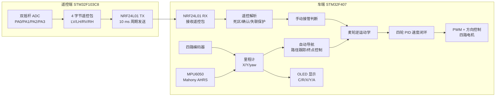
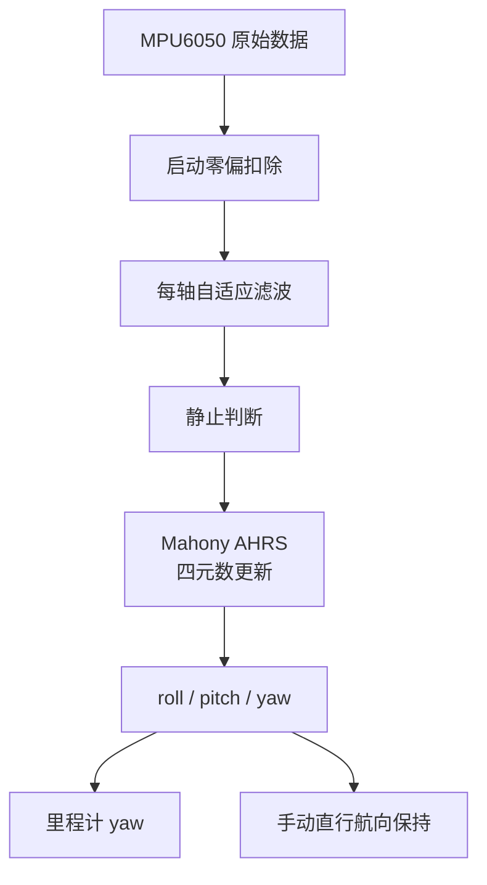
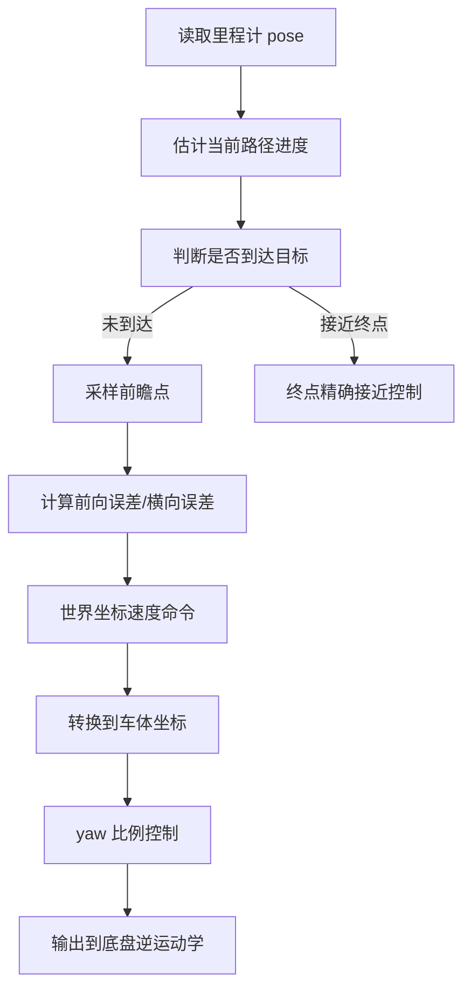

# STM32 四轮麦克纳姆轮自动定位导航小车

这是一个基于 STM32 的四轮麦克纳姆轮移动机器人项目。当前主分支只保留这个最完整、最适合展示的项目；之前仓库中原有的 STM32 学习项目已经保留到次级分支：

```text
legacy-stm32-learning-projects
```

当前项目已经完成 NRF24L01 遥控、四路编码器速度闭环、MPU6050 姿态估计、相对里程计、车端 OLED 实时坐标显示、自动定位导航和手动遥控接管。实测不打滑情况下 3 米级自动导航平均误差小于 3 cm。

## 快速看点

| 方向 | 实现内容 |
| --- | --- |
| 主控平台 | 车端 STM32F407，遥控端 STM32F103C8 |
| 底盘结构 | 四轮麦克纳姆轮，全向移动 |
| 通信 | NRF24L01 单向遥控链路，Basic Auto ACK，固定 4 字节遥控包 |
| 电机控制 | 四路编码器测速，四轮独立 PID 速度闭环 |
| 姿态估计 | MPU6050 陀螺仪/加速度计，启动静态零偏采集，Mahony AHRS，动态/静态零偏补偿 |
| 定位 | 四轮编码器里程计 + IMU yaw，输出相对 X/Y/yaw |
| 导航 | 三次贝塞尔路径生成，平滑加减速，前瞻路径跟踪，终点精确接近控制 |
| 人机交互 | 车端 OLED 显示 NRF 状态、X/Y 坐标、航向角 |
| 实测结果 | 3 m 自动导航平均误差 < 3 cm |

## 仓库结构

```text
STM32-Project/
|-- 00_Car_Mecanum_Wheels_AutoNavigation/
|   |-- Core/
|   |-- Drivers/
|   |-- Middlewares/
|   |-- MDK-ARM/
|   |   |-- Mecanum_Wheels_Car(new).uvprojx
|   |   |-- pid.c
|   |   |-- pid.h
|   |   `-- UserApp/Core/
|   |       |-- Inc/
|   |       `-- Src/
|   |           |-- app.c
|   |           |-- app_freertos.c
|   |           |-- app_remote.c
|   |           |-- app_chassis.c
|   |           |-- app_motor.c
|   |           |-- app_encoder.c
|   |           |-- app_odometry.c
|   |           |-- app_navigation.c
|   |           |-- app_path_planner.c
|   |           |-- app_mpu6050.c
|   |           |-- app_imu_ahrs.c
|   |           |-- app_imu_filter.c
|   |           |-- app_oled.c
|   |           |-- app_nrf24l01.c
|   |           `-- app_nrf_remote.c
|-- 00_Remote_NRF_Controller/
|   |-- Core/
|   |-- Drivers/
|   |-- Hardware/
|   |-- System/
|   `-- MDK-ARM/
|       `-- NRF_Remote.uvprojx
|-- 00_Firmware_HEX/
|   |-- car_mecanum_auto_navigation.hex
|   `-- remote_nrf_controller.hex
|-- .gitignore
`-- README.md
```

## 系统架构



设计重点是把 NRF 链路从“遥控 + 坐标回传”改成“只负责遥控”。坐标显示放到车端 OLED，避免 ACK Payload 或双向切换占用无线时序，保证遥控响应稳定。

## 当前工程状态

当前版本在发布前已经重新编译验证：

| 工程 | Keil 项目 | 结果 |
| --- | --- | --- |
| 车端 | `00_Car_Mecanum_Wheels_AutoNavigation/MDK-ARM/Mecanum_Wheels_Car(new).uvprojx` | 0 Error, 0 Warning |
| 遥控端 | `00_Remote_NRF_Controller/MDK-ARM/NRF_Remote.uvprojx` | 0 Error, 0 Warning |

可以直接烧录：

```text
00_Firmware_HEX/car_mecanum_auto_navigation.hex
00_Firmware_HEX/remote_nrf_controller.hex
```

## 核心算法说明

### 1. 麦克纳姆轮逆运动学

代码位置：

```text
00_Car_Mecanum_Wheels_AutoNavigation/MDK-ARM/UserApp/Core/Src/app_chassis.c
```

输入为归一化车体运动命令：

```text
vx: 前进/后退，范围 -1.0 ~ 1.0
vy: 左右平移，范围 -1.0 ~ 1.0
w : 原地旋转，范围 -1.0 ~ 1.0
```

四轮目标量由麦轮逆运动学得到：

```c
front_left  = vx - vy + w;
front_right = vx + vy - w;
rear_left   = vx + vy + w;
rear_right  = vx - vy - w;
```

为了避免某一个轮子目标超过 PWM 极限，代码会做整体归一化：

```text
max_magnitude = max(1, abs(FL), abs(FR), abs(RL), abs(RR))
wheel_i = wheel_i / max_magnitude
```

然后再乘每个轮子的独立标定系数：

```c
#define CHASSIS_FL_GAIN  1.00f
#define CHASSIS_FR_GAIN  0.97f
#define CHASSIS_RL_GAIN  1.00f
#define CHASSIS_RR_GAIN  0.97f
```

这个设计的意义是：先保持麦轮运动学模型正确，再用轮子增益补偿电机、减速箱、轮径和摩擦差异。

### 2. 遥控输入整形算法

代码位置：

```text
00_Car_Mecanum_Wheels_AutoNavigation/MDK-ARM/UserApp/Core/Src/app_remote.c
00_Car_Mecanum_Wheels_AutoNavigation/MDK-ARM/UserApp/Core/Src/app_nrf_remote.c
00_Remote_NRF_Controller/Core/Src/main.c
```

遥控端每 10 ms 读取四路 ADC，并发送固定 4 字节：

```c
NRF24L01_TxPacket[0] = left vertical;
NRF24L01_TxPacket[1] = left horizontal;
NRF24L01_TxPacket[2] = right vertical;
NRF24L01_TxPacket[3] = right horizontal;
```

车端解析后做多级处理：

| 步骤 | 目的 |
| --- | --- |
| 中值映射 | 把 0~255 转换为 -100~100 |
| 平移死区 | 抑制摇杆中位漂移 |
| yaw 单轴死区 | 右摇杆两个轴先单独死区，再合成旋转 |
| 连续新包确认 | 平移和旋转都需要连续 3 个新包确认才输出 |
| 失联保护 | 500 ms 内没有新遥控包则停车 |
| 停车确认 | 过滤偶发异常包，减少空闲时轮子抽动 |

关键参数：

```c
#define RC_LOST_TIMEOUT_MS      500U
#define RC_YAW_AXIS_DEADZONE    18
#define RC_YAW_DEADZONE         30
#define RC_YAW_CONFIRM_COUNT    3U
#define RC_MOVE_DEADZONE        10
#define RC_MOVE_CONFIRM_COUNT   3U
#define RC_STOP_CONFIRM_MS      80U
```

这部分解决过一个实际问题：摇杆不动时偶发异常包会让轮子动一下。现在通过“死区 + 新包确认 + 停车保持”降低误动作。

### 3. 四轮编码器 PID 速度闭环

代码位置：

```text
00_Car_Mecanum_Wheels_AutoNavigation/MDK-ARM/pid.c
00_Car_Mecanum_Wheels_AutoNavigation/MDK-ARM/pid.h
```

PID 任务周期：

```c
#define PID_RUN_PERIOD_MS  10U
```

每个周期读取编码器计数差作为速度反馈：

```c
now_speed = now_count - last_count;
error = target_speed - now_speed;
```

输出采用“目标 PWM 前馈 + PID 修正”的形式：

```c
base_pwm = target_pwm;
output = base_pwm
       + kp * error
       + ki * sum_error
       + kd * change_error;
```

当前参数：

```c
#define PID_DEFAULT_KP     400.0f
#define PID_DEFAULT_KI     5.0f
#define PID_DEFAULT_KD     0.0f
#define PID_SUM_ERROR_MAX  300.0f
```

这里使用前馈的原因是电机需要基础 PWM 才能克服静摩擦，PID 只负责补偿速度误差。积分项做限幅，避免长时间堵转或起步误差导致积分过大。

### 4. MPU6050 姿态估计与航向保持

代码位置：

```text
00_Car_Mecanum_Wheels_AutoNavigation/MDK-ARM/UserApp/Core/Src/app_mpu6050.c
00_Car_Mecanum_Wheels_AutoNavigation/MDK-ARM/UserApp/Core/Src/app_imu_ahrs.c
00_Car_Mecanum_Wheels_AutoNavigation/MDK-ARM/UserApp/Core/Src/app_imu_filter.c
```

启动时车必须静止，程序会采集陀螺仪和加速度计零偏：

```c
#define CALIB_WARMUP_MS  100U
#define CALIB_SAMPLES    1000U
#define CALIB_DELAY_MS   2U
```

也就是上电后约 2 秒用于静态标定。标定结果用于：

```text
gyro_x/y/z bias
accel_x/y offset
测量方差估计
```

姿态融合使用 Mahony AHRS。陀螺仪提供角速度积分，加速度计提供重力方向修正，输出 roll/pitch/yaw。



为了降低 yaw 漂移，代码还加入了静止检测和在线零偏微调：

```c
#define STATIONARY_RATE_DPS       1.2f
#define STATIONARY_BIAS_ALPHA     0.002f
#define STATIC_GYRO_NORM_DPS      2.0f
```

遥控直行时，如果没有主动旋转命令，会启用 P-only 航向保持，抑制车体缓慢偏航：

```c
#define HEADING_KP              8.0f
#define HEADING_MAX_CORRECTION  45.0f
#define HEADING_DEADBAND_DEG    0.5f
```

### 5. 四轮里程计定位算法

代码位置：

```text
00_Car_Mecanum_Wheels_AutoNavigation/MDK-ARM/UserApp/Core/Src/app_odometry.c
```

当前标定参数：

```c
#define ODOM_WHEEL_DIAMETER_MM       65.0f
#define ODOM_ENCODER_COUNTS_PER_REV  4320.0f
#define ODOM_FORWARD_SCALE           0.985f
#define ODOM_STRAFE_SCALE            0.960f
```

编码器增量先换算成轮子线位移：

```text
distance_mm = count_delta / counts_per_rev * pi * wheel_diameter
```

四轮位移再解算成车体坐标系下的前进量和平移量：

```c
body_forward_mm = ((d_fl + d_fr + d_rl + d_rr) * 0.25f) * ODOM_FORWARD_SCALE;
body_strafe_mm  = ((-d_fl + d_fr + d_rl - d_rr) * 0.25f) * ODOM_STRAFE_SCALE;
```

然后用 MPU6050 输出的 yaw 把车体位移转换到世界坐标系：

```c
x += forward * cos(yaw_mid) - strafe * sin(yaw_mid);
y += forward * sin(yaw_mid) + strafe * cos(yaw_mid);
```

这里使用 `yaw_mid` 中点积分，而不是直接使用更新后的 yaw。这样在小车边走边转时，位姿积分更平滑，累积误差更小。

这个项目的定位属于相对定位，也就是每次上电从当前位置作为 `(0, 0)` 开始。它不是 GPS/UWB/视觉那种绝对定位，但对室内短中距离自动导航已经可用。

### 6. 三次贝塞尔路径规划

代码位置：

```text
00_Car_Mecanum_Wheels_AutoNavigation/MDK-ARM/UserApp/Core/Src/app_path_planner.c
```

路径使用三次贝塞尔曲线：

```text
B(t) = (1-t)^3 P0
     + 3(1-t)^2 t P1
     + 3(1-t) t^2 P2
     + t^3 P3
```

控制点生成逻辑：

```text
P0 = 当前点
P3 = 目标点
P1 = 当前点 + 当前航向方向 * control
P2 = 目标点 - 目标方向 * control
```

其中 `control` 会根据起终点距离限制在合理范围：

```c
#define PATH_MIN_CONTROL_MM     80.0f
#define PATH_MAX_CONTROL_RATIO  0.45f
```

路径长度通过分段采样估算：

```c
#define PATH_LENGTH_SEGMENTS  24U
```

这种方法计算量小，适合 STM32 实时运行，同时能比直接折线运动更平滑。

### 7. 平滑速度规划

同样位于：

```text
app_path_planner.c
```

代码使用 smoothstep 函数做加减速：

```text
s = min(accel_progress, decel_progress)
speed_scale = 3s^2 - 2s^3
speed = min_speed + (max_speed - min_speed) * speed_scale
```

当前参数：

```c
#define PATH_DEFAULT_MIN_SPEED  70.0f
#define PATH_ACCEL_RATIO        0.25f
```

意义是让小车起步和刹车都更平滑，减少麦轮打滑和终点过冲。

### 8. 前瞻路径跟踪与横向误差修正

代码位置：

```text
00_Car_Mecanum_Wheels_AutoNavigation/MDK-ARM/UserApp/Core/Src/app_navigation.c
```

导航周期：

```c
#define NAV_TASK_PERIOD_MS  5U
```

核心流程：



前瞻距离：

```c
#define NAV_LOOKAHEAD_MM  100.0f
```

横向误差控制：

```c
cross_cmd = cross_error * NAV_CROSS_TRACK_KP
          + goal_cross_error * NAV_GOAL_TRACK_KP;
```

当前参数：

```c
#define NAV_POSITION_TOL_MM   25.0f
#define NAV_CROSS_TRACK_KP    0.009f
#define NAV_GOAL_TRACK_KP     0.0020f
#define NAV_YAW_KP            0.010f
#define NAV_YAW_LIMIT         0.28f
```

世界坐标速度会根据当前 yaw 转换到车体坐标：

```c
dx_body =  dx_world * cos(yaw) + dy_world * sin(yaw);
dy_body = -dx_world * sin(yaw) + dy_world * cos(yaw);
```

最后调用：

```c
Chassis_SetNormalizedMotion(dx_body, dy_body, yaw_cmd);
```

### 9. 终点精确接近控制

当小车距离目标点小于：

```c
#define NAV_FINAL_APPROACH_MM  300.0f
```

导航会切换到终点接近模式。此时不再主要依赖路径切线，而是直接根据目标点与当前点的误差做位置比例控制：

```text
dx = target_x - current_x
dy = target_y - current_y
```

再转换到车体坐标输出。终点允许误差：

```c
#define NAV_POSITION_TOL_MM  25.0f
```

这部分对最终 3 m 级测试能收敛到 5 cm 内非常关键，因为它把“沿路径跑”切换成了“对准终点收敛”。

### 10. FreeRTOS 任务划分

代码位置：

```text
00_Car_Mecanum_Wheels_AutoNavigation/MDK-ARM/UserApp/Core/Src/app_freertos.c
```

| 任务 | 周期 | 优先级 | 作用 |
| --- | --- | --- | --- |
| Remote_Task | 5 ms | 4 | 接收遥控，手动接管 |
| Navigation_TaskEntry | 5 ms | 4 | 自动导航路径跟踪 |
| Pid_Task | 10 ms | 3 | 四轮速度闭环 |
| Oled_Task | 50 ms | 1 | OLED 状态与坐标刷新 |

这样划分的原因是：遥控和导航优先级最高，保证运动命令及时更新；PID 稳定周期运行；OLED 最低优先级，避免显示刷新影响控制实时性。

## NRF 通信设计

### 为什么取消坐标回传

早期版本尝试过让遥控端 OLED 显示车端坐标，也就是 NRF 同时承担遥控下行和坐标上行。实际调试中出现过：

```text
遥控正常但坐标不回传
坐标回传但小车走走停停
摇杆固定时小车断续响应
```

原因是 ACK Payload 或收发模式切换会占用 NRF24L01 时序，遥控数据对实时性更敏感。一旦无线链路被回传数据拖住，车端就可能拿不到连续控制包。

当前设计选择：

```text
遥控端：只发送摇杆数据
车端：只接收遥控数据
坐标：只在车端 OLED 显示
```

关键配置：

| 参数 | 当前值 |
| --- | --- |
| 地址 | `11 22 33 44 55` |
| 通道 | `0x4C` |
| 速率 | `RF_SETUP = 0x27`，偏稳定低速率配置 |
| Payload | 固定 4 字节 |
| Auto ACK | 开启 Basic Auto ACK |
| ACK Payload / DPL | 关闭 |
| 遥控周期 | 10 ms |

这个取舍提升了遥控实时性，也让问题定位更简单。

## 自动导航使用方式

自动导航入口：

```text
00_Car_Mecanum_Wheels_AutoNavigation/MDK-ARM/UserApp/Core/Src/app.c
```

当前配置：

```c
#define APP_AUTO_NAV_ENABLE       1U
#define APP_AUTO_NAV_TARGET_X_MM  3000.0f
#define APP_AUTO_NAV_TARGET_Y_MM  500.0f
#define APP_AUTO_NAV_SPEED_MM_S   300.0f
```

含义：

```text
上电后自动启动导航
目标点 X = 3000 mm
目标点 Y = 500 mm
最大导航速度 = 300 mm/s
```

如果只想手动遥控：

```c
#define APP_AUTO_NAV_ENABLE  0U
```

如果要测试 1 m 直行：

```c
#define APP_AUTO_NAV_TARGET_X_MM  1000.0f
#define APP_AUTO_NAV_TARGET_Y_MM  0.0f
```

如果要测试 3 m 直行：

```c
#define APP_AUTO_NAV_TARGET_X_MM  3000.0f
#define APP_AUTO_NAV_TARGET_Y_MM  0.0f
```

自动导航过程中，只要遥控器出现有效手动输入，车端会立即停止自动导航并切换到手动控制。

## OLED 显示说明

车端 OLED 接在 STM32F407 上，显示格式类似：

```text
C:1 R:1
X: ...
Y: ...
A: ...
```

含义：

| 字段 | 含义 |
| --- | --- |
| C | 车端 NRF 初始化状态，1 表示成功 |
| R | 最近 500 ms 是否收到遥控包，1 表示收到 |
| X | 当前相对 X 坐标，单位 mm |
| Y | 当前相对 Y 坐标，单位 mm |
| A | 当前 yaw 航向角，单位 degree |

## 接线说明

### 车端 NRF24L01

定义位置：

```text
00_Car_Mecanum_Wheels_AutoNavigation/MDK-ARM/UserApp/Core/Src/app_nrf24l01.c
```

| NRF24L01 | 车端 STM32 |
| --- | --- |
| VCC | 3.3V |
| GND | GND |
| CE | PA8 |
| CSN/CS | PB8 |
| SCK | PB3 |
| MISO | PB4 |
| MOSI | PB5 |
| IRQ | PB9，可接可不接，当前主要轮询接收 |

NRF24L01 只能接 3.3V。建议在模块 VCC/GND 旁边并联 10 uF 到 47 uF 电容，减少发送瞬间电压波动。

### 车端 OLED

定义位置：

```text
00_Car_Mecanum_Wheels_AutoNavigation/MDK-ARM/UserApp/Core/Src/app_oled.c
```

| OLED | 车端 STM32 |
| --- | --- |
| VCC | 3.3V，或 OLED 模块允许的供电 |
| GND | GND |
| SCL | PC8 |
| SDA | PC9 |

OLED 默认使用 SSD1306 常见地址：

```text
7 位地址 0x3C
8 位写地址 0x78
```

### 遥控端 NRF24L01

定义位置：

```text
00_Remote_NRF_Controller/Hardware/NRF24L01.c
```

| NRF24L01 | 遥控端 STM32F103C8 |
| --- | --- |
| VCC | 3.3V |
| GND | GND |
| CE | PB11 |
| CSN/CS | PB12 |
| SCK | PB13 |
| MISO | PB14 |
| MOSI | PB15 |

### 遥控端摇杆 ADC

| 摇杆通道 | STM32F103C8 |
| --- | --- |
| 左摇杆纵向 | PA0 / ADC_CHANNEL_0 |
| 左摇杆横向 | PA1 / ADC_CHANNEL_1 |
| 右摇杆纵向 | PA2 / ADC_CHANNEL_2 |
| 右摇杆横向 | PA3 / ADC_CHANNEL_3 |

## 标定方法

### 前进 X 标定

1. 关闭自动导航，只用遥控让小车直行。
2. 实际测量走过的距离，例如 800 mm。
3. 读取 OLED 上的 X 坐标，例如 742 mm。
4. 按公式修正：

```text
新的 ODOM_FORWARD_SCALE =
当前 ODOM_FORWARD_SCALE * 实际距离 / OLED显示距离
```

示例：

```text
当前比例 = 0.985
实际距离 = 800
OLED 显示 = 742
新比例 = 0.985 * 800 / 742
```

### 侧移 Y 标定

1. 关闭自动导航，只用遥控让小车侧移。
2. 实际测量侧移距离，例如 800 mm。
3. 读取 OLED 上的 Y 坐标，取绝对值。
4. 按公式修正：

```text
新的 ODOM_STRAFE_SCALE =
当前 ODOM_STRAFE_SCALE * 实际距离 / abs(OLED显示距离)
```

Y 为负数不一定是错，只代表坐标系把这个方向定义为负方向。

### 标定建议

| 项目 | 建议 |
| --- | --- |
| 前进 | 800 mm 或 1000 mm，测 3 次取平均 |
| 后退 | 800 mm 或 1000 mm，验证正反方向一致性 |
| 左右侧移 | 左右各测 3 次 |
| 原地旋转 | 90 度、180 度，检查 yaw |
| 自动导航 | 先测 1 m，再测 3 m，最后再扩展到更远 |

不要把车架空后用 OLED 坐标标定里程计。架空时没有真实地面接触，无法反映麦轮打滑、轮胎变形、负载、地面摩擦和起停惯性。

## 项目难点与解决方案

| 难点 | 现象 | 解决方式 |
| --- | --- | --- |
| NRF 双向通信影响遥控 | 坐标能回传但小车走走停停 | 放弃遥控端坐标显示，NRF 只做遥控，坐标放车端 OLED |
| 遥控空闲误动作 | 不动摇杆时轮子偶发动一下 | 死区、新包确认、失联保护、停车确认 |
| 直线走偏 | 四轮输出一致但车体偏航 | 每轮独立增益 + 编码器 PID + 航向保持 |
| 里程计比例不准 | OLED 显示距离和实际距离不一致 | 前进/侧移比例分开标定 |
| 终点过冲 | 自动导航到终点后还会滑过 | smoothstep 加减速 + 终点接近控制 |
| yaw 漂移 | 每次上电方向或行驶方向不稳定 | 启动静态零偏采集、Mahony AHRS、静止零偏微调 |

## 面试可以重点讲的点

1. 这个项目不是简单遥控车，而是完整的嵌入式移动机器人控制系统。
2. 从 NRF 通信、FreeRTOS 任务调度、PID 闭环、麦轮运动学、IMU 姿态估计到路径跟踪，形成了完整闭环。
3. 遇到过 NRF 双向通信导致实时性下降的问题，最后通过架构取舍解决，而不是单纯堆调试代码。
4. 里程计不是直接读编码器，而是结合麦轮运动学、标定系数和 MPU6050 yaw 做坐标积分。
5. 自动导航不是固定延时开环，而是根据实时坐标进行反馈控制，能够手动接管。
6. 项目经过实际标定和测试，3 m 级导航平均误差小于 5 cm。

## 当前局限与后续方向

当前定位是相对里程计，误差会随距离累积。短中距离可以通过标定得到较好效果，但几十米高精度导航需要绝对位置修正。

可扩展方向：

| 方向 | 作用 |
| --- | --- |
| UWB | 给出室内绝对位置参考，抑制长距离累计误差 |
| AprilTag / 二维码地标 | 低成本绝对位置校正 |
| 视觉里程计 | 减少纯轮式里程计的打滑误差 |
| EKF 融合 | 融合编码器、IMU 和外部定位观测 |
| 更严格的 UMBmark 标定 | 系统性补偿轮径、轮距、安装误差 |
| MPC 控制 | 提升高速或复杂路径下的跟踪精度 |

## 编译与烧录

### 车端

打开 Keil 工程：

```text
00_Car_Mecanum_Wheels_AutoNavigation/MDK-ARM/Mecanum_Wheels_Car(new).uvprojx
```

或直接烧录：

```text
00_Firmware_HEX/car_mecanum_auto_navigation.hex
```

### 遥控端

打开 Keil 工程：

```text
00_Remote_NRF_Controller/MDK-ARM/NRF_Remote.uvprojx
```

或直接烧录：

```text
00_Firmware_HEX/remote_nrf_controller.hex
```

## 常见问题

### OLED 显示 C:0 R:0

车端 NRF 初始化失败。优先检查：

| 检查项 | 说明 |
| --- | --- |
| 供电 | NRF 必须 3.3V |
| 接线 | CE/CSN/SCK/MISO/MOSI 是否接反 |
| 共地 | 车端主控、电机驱动、NRF 必须共地 |
| 电容 | NRF VCC/GND 旁边建议加 10 uF 到 47 uF |

### OLED 显示 C:1 R:0

车端 NRF 初始化成功，但没有收到遥控包。检查：

| 检查项 | 说明 |
| --- | --- |
| 遥控端烧录 | 是否烧录最新遥控 HEX |
| 遥控端 NRF | 接线和 3.3V 供电 |
| 通道/地址 | 两端必须一致 |
| 距离 | NRF 太近或供电不稳都可能异常 |

### 上电后车自己跑

检查：

```c
#define APP_AUTO_NAV_ENABLE  1U
```

如果只想手动遥控，改成：

```c
#define APP_AUTO_NAV_ENABLE  0U
```

### 远距离误差变大

这是纯相对里程计的正常限制。编码器误差、麦轮打滑、地面摩擦、yaw 漂移都会随距离累积。解决方向不是无限调参数，而是加入 UWB、AprilTag、视觉或其他绝对位置观测，再用 EKF 融合。

## 版本说明

当前 main 分支用于展示这个完整项目。旧 STM32 学习项目已经移动到：

```text
legacy-stm32-learning-projects
```

如果只想看最能代表当前能力的项目，直接看 main 分支即可。
